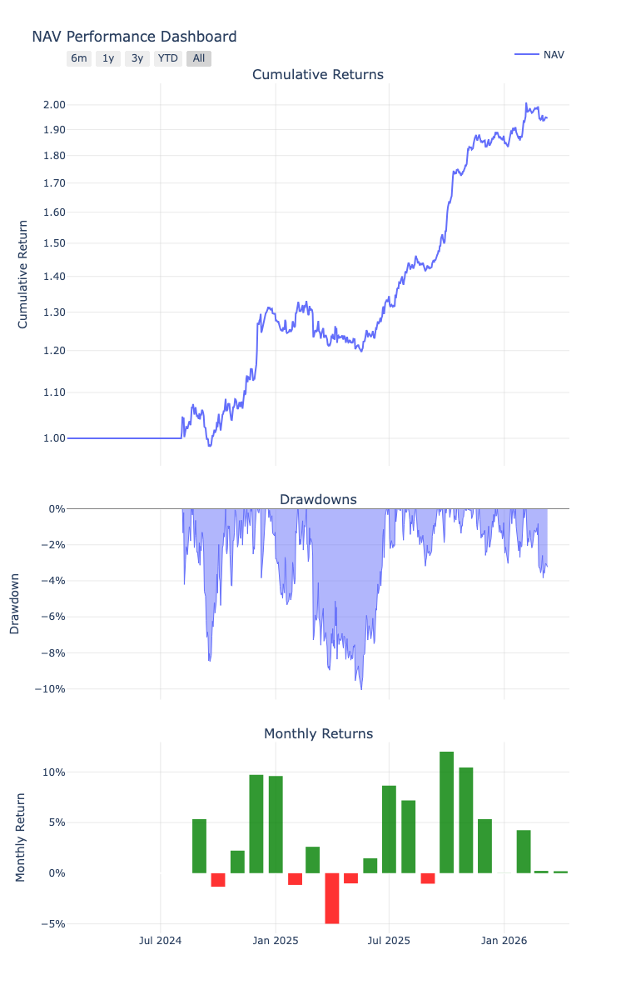

# Trend Strategy
###### Quantitative Research & Systematic Trading Platform

## Overview
This is a personal project that bridges the gap between theoretical quantitative research and the realities of live market execution. The codebase is capable of handling the entire strategy lifecycle, from raw data ingestion through risk-managed execution to reconciliation between live trading and simulated results.

The primary objective here is consistency between backtest results and live results. The secondary objective is code that is modular to swap out different models or exchanges without a complete rewrite.

## Purpose of the Project
This project is a way to keep my market knowledge and Python skills sharp. As an ancillary benefit, I believe this strategy will be a diversifier to the rest of my investment portfolio, because the strategy is divergent, and trades on a universe that has lower correlation with traditional markets.

## Core Components
* **Automated Data Pipeline**: A structured SQL-based market data layer that feeds into historical simulations and live trading.
* **Backtesting**: Reliance on CVX Simulator to simulate strategy performance using historical data
* **Execution & Connectivity**: A live trading layer that interfaces with external APIs to submit/cancel orders and retrieve and log orders submitted and fills.
* **Universe**: The system uses portfolio-level mean-variance optimization. Universe choice is top 50 coins by market cap. Instrument is perpetual futures.
* **Production**: Docker for consistent environment, and Git for version control.

## Why Perpetual Futures?
1. **Accessibility**: The APIs and data are open 24/7. This allows for continuous testing and iteration outside of traditional working hours without any conflict of interest with my professional role.
2. **Technical Complexity**: Perpetuals are a relatively new financial instrument and have unique mechanics like funding rates and Auto-Deleveraging (ADL). This project enabled me to learn first-hand how these mechanics work in practice.

### Backtest output:
- Generated 2026/03/11 using scripts.backtest
- Output saved as ipynb in Examples
